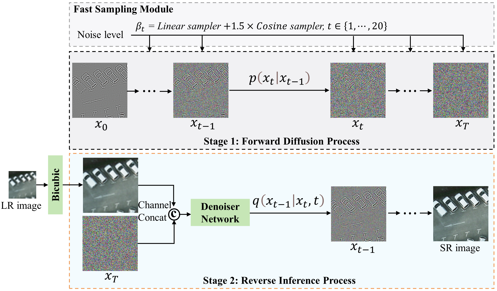
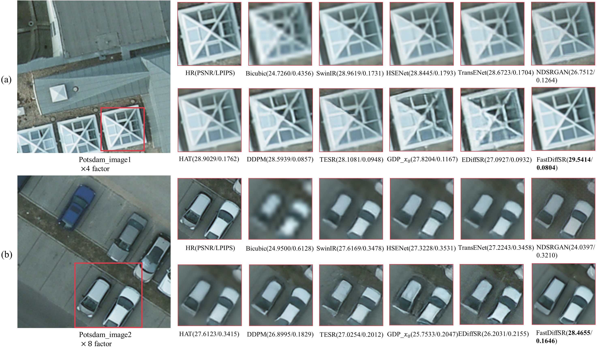

# **FastDiffSR**

Our code will be coming soon...




**Fig. 2.** Overview structure of the proposed FastDiffSR diffusion framework. The two stages are noise addition and denoising according to the fast sampling module with T = 20 steps. x0 is the residual image of the subtraction between the HR image and the Bicubic image..


## Folder Structure

Our folder structure is as follows:

```
├── FastDiffSR (code)
│   ├── config
│   │   ├── sr_fastdiffsr_train_64_256.json
│   │   ├── sr_fastdiffsr_train_32_256.json
│   │   ├── sr_fastdiffsr_test_64_256.json
│   │   ├── sr_fastdiffsr_test_32_256.json
│   ├── core
│   ├── data
│   ├── dataset
│   │   ├── Train_64_256
│   │   |   ├── hr_256
│   │   |   ├── lr_64
│   │   |   ├── sr_64_256
│   │   ├── Train_32_256 (the same as above)
│   │   ├── val_64_256   (the same as above)
│   │   ├── val_32_256   (the same as above)
│   │   ├── Test_Potsdam_64_256 (the same as above)
│   │   ├── Test_Potsdam_32_256 (the same as above)
│   │   ├── Test_Toronto_64_256 (the same as above)
│   │   ├── Test_Toronto_32_256 (the same as above)
│   ├── model        (DDPM,TESR,GDP_x0,FastDiffSR model)
│   │   ├── ddpm_modules
│   │   ├── sr3_modules
│   │   ├── tesr_modules
│   │   ├── gdp_modules
│   │   ├── fastdiffsr_modules
│   ├── MSI_SR_model (SwinIR,HSENet,TransENet,NDSRGAN,HAT model)
│   ├── EDiffSR (EDiffSR model)
│   ├── sr_mfe.py
│   ├── infer.py
```

## Introduction

- FastDiffSR (diffusion model architecture): This project is based on [[sr3]](https://github.com/Janspiry/Image-Super-Resolution-via-Iterative-Refinement)

  - Contains ten super-resolution models: ['SwinIR', 'HSENet', 'TransENet', 'NDSRGAN', 'HAT', 'DDPM',  'TESR', 'GDP_x0','EDiffSR', '**FastDiffSR**']
  - MSI_SR_model (traditional generative model architecture): This project is based on [[sradsgan]](https://github.com/Meng-333/SRADSGAN) 
  - EDiffSR (conditional diffusion model): This project is based on [[ediffsr]](https://github.com/XY-boy/EDiffSR) 


## Environment Installation

The HAT model uses python 3.8, pytorch 1.9, tensorflow-gpu 2.1.0, and the environment of other models is in requirements.txt

```bash
pip install -r requirements.txt
```

## Dataset Preparation

We used two datasets to train our model. After secondary processing, we obtained a total of about 22,852 images of 256*256 size.  

- Train
  
  - ["Potsdam", "Toronto"]
  
- Test
  
  - ["Test_Potsdam", "Test_Toronto"]

- Infer
  
  - ["UC Merced data"]
  
- Link:   https://drive.google.com/drive/folders/1W_ZWHp8BhoeLdEKLF3eAsZTneaVJVgLy?usp=sharing 

  ```bash
  cd FastDiffSR/dataset
  python prepare_data_mfe_dm.py   # Generate corresponding hr, lr, sr folders based on Train and Test data
  ```
  

## Train & Evaluate
1. Prepare environment, datasets and code.
2. Run training / evaluation code. The code is for training on 1 GPU.

```bash
# FastDiffSR
cd FastDiffSR 
python sr_mfe.py -p train -c config/sr_fastdiffsr_train_64_256.json   # train x4
python sr_mfe.py -p val -c config/sr_fastdiffsr_test_64_256.json      # test  x4
python sr_mfe.py -p train -c config/sr_fastdiffsr_train_32_256.json   # train x8
python sr_mfe.py -p val -c config/sr_fastdiffsr_test_32_256.json      # test  x8
---------------------------------------------------------------
# DDPM,TESR,GDP_x0 (the same as above)
# SwinIR,HSENet,TransENet,NDSRGAN,HAT:
cd MSI_SR_model
python main_swinir.py
python main_hsenet.py
python main_transenet.py
python main_ndsrgan.py
python main_hat.py
---------------------------------------------------------------
net.train()                       # train
net.mfeNew_validate()             # test
net.mfeNew_validateByClass()      # classes test
---------------------------------------------------------------
# EDiffSR
cd EDiffSR/codes/config/sisr
python train.py -opt=options/train/fastdiffsr_train.yml            # train
python test.py -opt=options/test/fastdiffsr_test.yml               # test


```

## Results

### 1. Comparisons With The State-of-the-Art Methods



**Fig. 7.** ×4 and ×8 visual comparisons with various SR methods on Potsdam dataset.


**Fig. 8.** ×4 and ×8 visual comparisons with various SR methods on Toronto dataset


### 2. Evaluation of Real-world Multispectral Images


**Fig. 9.** 4x visual comparisons of inference experiments on the UC Merced data. Here we show two scenes.


